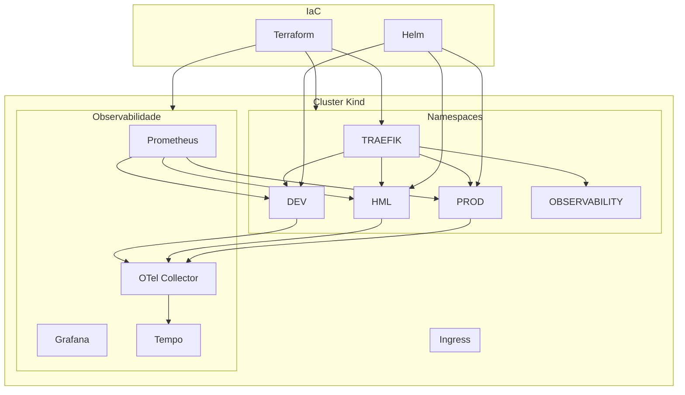

# Platform Architecture

## Objetivo

Definir a arquitetura oficial da plataforma challenge-devops.

Este documento consolida responsabilidades, componentes da plataforma, namespaces e limites arquiteturais entre Terraform, Helm e GitHub Actions.

---

# Arquitetura Geral



A plataforma é composta por três camadas principais:

```text
Terraform
↓
Provisionamento da Infraestrutura da Plataforma

Helm
↓
Deployment da Aplicação

GitHub Actions
↓
CI/CD, DevSecOps e IaC Quality
```

Cada recurso possui um único responsável. Nenhum recurso poderá ser gerenciado simultaneamente por mais de uma ferramenta.

---

# Cluster Kubernetes (Kind)

O cluster Kind já está provisionado e operacional.

Configuração atual:

```yaml
# deploy/kind/cluster.yml
nodes:
- role: control-plane
  extraPortMappings:
  - containerPort: 30080 → hostPort: 80
  - containerPort: 30443 → hostPort: 443
- role: worker
  labels:
    role: platform-app
- role: worker
  labels:
    role: platform-observability
```

Atualmente provisionado via comando local (`kind create cluster --config deploy/kind/cluster.yml`).

Evolução futura: gerenciamento via Terraform (terraform/bootstrap/).

---

# Terraform

Responsável pelo provisionamento e gerenciamento da infraestrutura da plataforma no cluster Kubernetes.

## Escopo Atual

* Namespaces
* ResourceQuotas
* LimitRanges
* NetworkPolicies
* Traefik (Ingress Controller)
* Prometheus
* Grafana
* Tempo
* OpenTelemetry Collector
* GHCR Pull Secrets (ativo com credenciais)

## Escopo Futuro

* Cluster Kind (via bootstrap)
* Loki
* Promtail

Terraform é a única fonte de verdade da plataforma.

---

# Helm

Responsável exclusivamente pelos recursos da aplicação.

## Escopo

* Deployment
* Service
* ConfigMap
* Secret
* IngressRoute
* HPA (futuro)
* PDB (futuro)

Helm não é responsável por componentes da plataforma.

---

# GitHub Actions

Responsável pelos processos de integração contínua, segurança, qualidade IaC e entrega.

## CI

* Ruff
* Black
* Isort
* Pytest

## Quality (Terraform)

* terraform fmt -check
* terraform validate
* tflint
* terraform-docs

## Security

* Trivy (vulnerabilidades na imagem Docker)
* SBOM (CycloneDX)
* Cosign (assinatura de imagens)
* SARIF (upload de resultados)
* Checkov (segurança em IaC)

## Delivery

* Build
* Push
* Promoção DEV → HML → PROD
* Helm Deploy
* Health Checks

GitHub Actions não cria infraestrutura.

---

# Namespaces

## Aplicação

```text
dev
hml
prod
```

Responsáveis pelo deployment da aplicação FastAPI.
Gerenciados pelo Terraform via módulo namespace.

## Plataforma

### Namespace: observability

Responsável por:
* Prometheus
* Grafana
* Tempo
* OpenTelemetry Collector
* Loki (futuro)
* Promtail (futuro)

### Namespace: traefik

Responsável por:
* Traefik Ingress Controller
* Routing Layer
* Ingress Traffic Management

---

# Estrutura Terraform

```text
terraform/
├── .checkov.yml                    # Checkov config (IaC security)
├── .tflint.hcl                     # TFLint config
├── bootstrap/                      # (futuro - cluster Kind via Terraform)
├── environments/
│   ├── dev/                        # namespace + governance
│   ├── hml/                        # namespace + governance
│   ├── prod/                       # namespace + governance
│   ├── observability/              # namespace + governance + stack observability
│   ├── traefik/                    # namespace + governance + Traefik
│   └── security/                   # NetworkPolicies + GHCR Secret
└── modules/
    ├── namespace/                  # Namespace, Labels, Annotations
    ├── governance/                 # ResourceQuota, LimitRange
    ├── security/                   # NetworkPolicies, GHCR Pull Secret
    ├── observability/              # Prometheus, Grafana, Tempo, OTel
    └── platform/                   # Traefik
```

---

# Responsabilidades dos Módulos

## namespace

Responsável por:
* Namespace
* Labels
* Annotations

Provider: kubernetes

---

## governance

Responsável por:
* ResourceQuota
* LimitRange

Provider: kubernetes

---

## security

Responsável por:
* NetworkPolicies (Default Deny + Allow Rules)
* GHCR Pull Secret

Recursos:
* default-deny-ingress
* default-deny-egress
* allow-dns-egress
* allow-ingress-from-traefik
* allow-ingress-from-prometheus
* allow-egress-to-otel
* ghcr-pull-secret

Provider: kubernetes

---

## observability

Responsável por:
* Prometheus
* Grafana
* Tempo
* OpenTelemetry Collector

Evolução futura:
* Loki
* Promtail

Provider: helm

---

## platform

Responsável por:
* Traefik
* Routing Layer
* Componentes compartilhados de acesso

Provider: helm

---

# Ordem de Execução dos Environments

```bash
# 1. Namespaces de aplicação (podem ser executados em paralelo)
cd dev/     && terraform init && terraform apply
cd ../hml   && terraform init && terraform apply
cd ../prod  && terraform init && terraform apply

# 2. Ingress Controller
cd ../traefik && terraform init && terraform apply

# 3. Observabilidade
cd ../observability && terraform init && terraform apply

# 4. Segurança (depende de TODOS os namespaces)
cd ../security && terraform init && terraform apply
```

---

# Princípios Arquiteturais

1. Terraform provisiona infraestrutura da plataforma.
2. Helm entrega aplicações.
3. GitHub Actions orquestra pipelines.
4. Infrastructure as Code é a única fonte de verdade.
5. Toda infraestrutura deve ser reproduzível.
6. Toda alteração deve ser auditável.
7. Nenhum recurso possui múltiplos responsáveis.
8. Toda plataforma deve ser reconstruível através de código.