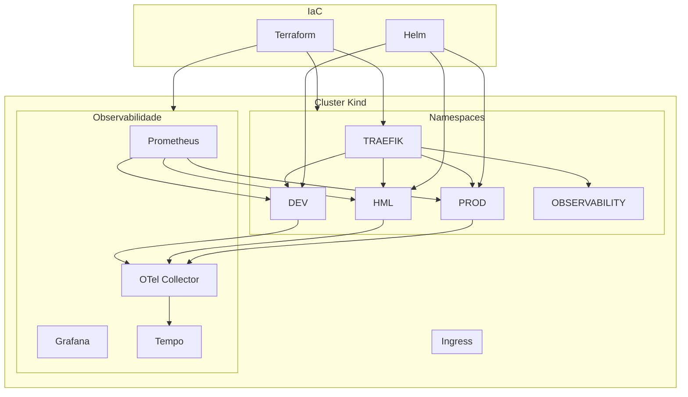

# Challenge DevOps - Project Context

## Visão Geral

O challenge-devops é um projeto de demonstração prática de DevOps, DevSecOps, Kubernetes, Observabilidade e Platform Engineering.

A plataforma utiliza FastAPI, Docker, Kubernetes (Kind), Terraform, Helm, GitHub Actions, Prometheus, Grafana, Tempo, OpenTelemetry Collector, Trivy, SBOM, Cosign, Checkov e TFLint para simular um ambiente corporativo moderno com múltiplos ambientes (DEV, HML e PROD) e promoção imutável de artefatos.

Loki e Promtail estão previstos como evolução futura da stack de observabilidade.

---

## Objetivo da Evolução Terraform

Introduzir Terraform como camada oficial de Infrastructure as Code da plataforma.

A implementação tem como objetivo eliminar dependências operacionais manuais e transformar toda a infraestrutura compartilhada em código reproduzível, auditável e versionado.

Terraform é a única fonte de verdade para a infraestrutura da plataforma.

---

## Arquitetura



### Cluster Kubernetes (Kind)

O cluster Kind já está provisionado e operacional, com 1 control-plane e 2 workers (labels: `platform-app` e `platform-observability`).

Atualmente provisionado via `kind create cluster --config deploy/kind/cluster.yml`.

Evolução futura: gerenciamento via Terraform (terraform/bootstrap/).

### Terraform

Responsável pelo provisionamento e gerenciamento da infraestrutura da plataforma no cluster Kubernetes.

#### Escopo Atual

* Namespaces
* ResourceQuotas
* LimitRanges
* NetworkPolicies
* Traefik (Ingress Controller)
* Prometheus
* Grafana
* Tempo
* OpenTelemetry Collector
* GHCR Pull Secrets

#### Escopo Futuro

* Cluster Kind (via bootstrap)
* Loki
* Promtail

### Helm

Responsável exclusivamente pelos recursos da aplicação.

#### Escopo

* Deployment
* Service
* ConfigMap
* Secret
* IngressRoute
* HPA (futuro)
* PDB (futuro)

### GitHub Actions

Responsável pelos fluxos de integração contínua, segurança, promoção e entrega.

#### CI

* Ruff
* Black
* Isort
* Pytest

#### Quality (Terraform)

* terraform fmt -check
* terraform validate
* tflint
* terraform-docs

#### Security

* Trivy (vulnerabilidades na imagem Docker)
* SBOM (CycloneDX)
* Cosign (assinatura de imagens)
* SARIF (upload de resultados para GitHub)
* Checkov (segurança em IaC)

#### Delivery

* Build
* Push
* Promotion DEV → HML → PROD
* Helm Deploy
* Health Checks

---

## Princípios Arquiteturais

1. Terraform provisiona infraestrutura.
2. Helm entrega aplicações.
3. GitHub Actions orquestra pipelines.
4. Nenhum recurso possui múltiplos responsáveis.
5. Toda infraestrutura deve ser reproduzível por código.
6. Toda alteração deve ser auditável.
7. Infrastructure as Code é a única fonte de verdade.

---

## ADRs

### ADR-001

Terraform será a ferramenta oficial de Infrastructure as Code.

Status: Accepted ✅

### ADR-002

Helm continuará sendo utilizado para deployment de aplicações.

Status: Accepted ✅

### ADR-003

GitHub Actions continuará sendo o orquestrador de CI/CD.

Status: Accepted ✅

### ADR-004

Terraform utilizará módulos reutilizáveis.

Status: Accepted ✅

### ADR-005

Observabilidade será instalada através do Helm Provider do Terraform.

Status: Accepted ✅

### ADR-006

Namespaces serão gerenciados exclusivamente pelo Terraform.

Status: Accepted ✅

### ADR-007

A stack de observabilidade será gerenciada exclusivamente pelo Terraform utilizando o Helm Provider. Validação realizada durante Sprint 4:

- `terraform state list` contém todas as releases Helm da stack
- `terraform plan` converge para "No changes"
- Nenhuma release é gerenciada manualmente via Helm
- Terraform é a única fonte de verdade da stack de observabilidade

Status: Accepted ✅

---

## Estrutura Terraform

```text
terraform/
├── .checkov.yml                # Configuração do Checkov (IaC security)
├── .tflint.hcl                 # Configuração do TFLint
├── bootstrap/                  # (vazio - aguardando implementação)
├── environments
│   ├── dev/                    # Namespace + Governance DEV
│   ├── hml/                    # Namespace + Governance HML
│   ├── prod/                   # Namespace + Governance PROD
│   ├── observability/          # Namespace + Governance + Stack Observabilidade
│   ├── traefik/                # Namespace + Governance + Traefik
│   └── security/               # NetworkPolicies + GHCR Secret (credenciais ativas)
└── modules
    ├── namespace/              # Namespace, Labels, Annotations
    ├── governance/             # ResourceQuota, LimitRange
    ├── platform/               # Traefik (via Helm Provider)
    ├── observability/          # Prometheus, Grafana, Tempo, OTel (via Helm Provider)
    └── security/               # NetworkPolicies, GHCR Pull Secret
```

Status dos módulos:

| Módulo | Provider | Status |
|---|---|---|
| namespace | kubernetes | ✅ Implementado |
| governance | kubernetes | ✅ Implementado |
| platform | helm | ✅ Implementado |
| observability | helm | ✅ Implementado |
| security | kubernetes | ✅ Implementado |

---

## Módulo Namespace

Responsável por:
* Namespace
* Labels
* Annotations

Entradas:
* namespace_name
* labels
* annotations

Saídas:
* namespace_name
* namespace_uid

---

## Módulo Governance

Responsável por:
* ResourceQuota
* LimitRange

Entradas:
* namespace
* requests_cpu
* requests_memory
* limits_cpu
* limits_memory
* default_cpu
* default_memory
* max_cpu
* max_memory

Saídas:
* resource_quota_name
* limit_range_name

---

## Módulo Security

Responsável por:
* NetworkPolicies (Default Deny + Allow Rules)
* GHCR Pull Secret

Recursos de NetworkPolicy:
* default-deny-ingress
* default-deny-egress
* allow-dns-egress
* allow-ingress-from-traefik
* allow-ingress-from-prometheus
* allow-egress-to-otel

Entradas:
* namespace
* enable_default_deny_ingress (bool, default: true)
* enable_default_deny_egress (bool, default: true)
* enable_allow_dns_egress (bool, default: true)
* enable_allow_ingress_from_traefik (bool, default: true)
* enable_allow_ingress_from_prometheus (bool, default: false)
* enable_allow_egress_to_otel (bool, default: false)
* enable_ghcr_secret (bool, default: false)
* ghcr_registry_server (string, default: "ghcr.io")
* ghcr_username (string)
* ghcr_password (string, sensitive)

Saídas:
* namespace
* ghcr_secret_name
* default_deny_ingress_name
* default_deny_egress_name
* allow_dns_egress_name
* allow_traefik_ingress_name
* allow_prometheus_ingress_name
* allow_otel_egress_name

---

## Módulo Platform

Responsável por:
* Traefik
* Configurações compartilhadas da plataforma Kubernetes
* Componentes de acesso e roteamento

Entradas:
* namespace
* traefik_chart_version
* replicas
* web_node_port
* websecure_node_port
* node_selector_role

Saídas:
* traefik_release

---

## Módulo Observability

Responsável por:
* Prometheus
* Grafana
* Tempo
* OpenTelemetry Collector

Entradas:
* namespace
* prometheus_version
* grafana_version
* tempo_version
* otel_collector_version
* prometheus_values_file
* grafana_values_file
* tempo_values_file
* otel_collector_values_file

Saídas:
* prometheus_release
* grafana_release
* tempo_release
* otel_collector_release

Evolução futura:
* Loki
* Promtail

---

## Namespaces da Plataforma

### DEV

Ambiente de desenvolvimento.
- Namespace gerenciado por Terraform ✅
- ResourceQuota + LimitRange ✅
- Default Deny + Allow Rules (DNS, Traefik, Prometheus, OTel) ✅
- GHCR Pull Secret (credenciais configuradas ✅, ativo)

### HML

Ambiente de homologação.
- Namespace gerenciado por Terraform ✅
- ResourceQuota + LimitRange ✅
- Default Deny + Allow Rules (DNS, Traefik, Prometheus, OTel) ✅
- GHCR Pull Secret (credenciais configuradas ✅, ativo)

### PROD

Ambiente de produção.
- Namespace gerenciado por Terraform ✅
- ResourceQuota + LimitRange ✅
- Default Deny + Allow Rules (DNS, Traefik, Prometheus, OTel) ✅
- GHCR Pull Secret (credenciais configuradas ✅, ativo)

### OBSERVABILITY

Responsável por:
* Prometheus
* Grafana
* Tempo
* OpenTelemetry Collector

- Namespace gerenciado por Terraform ✅
- ResourceQuota + LimitRange ✅
- Default Deny + Allow Rules (DNS + Traefik apenas) ✅
- GHCR Pull Secret: não se aplica (namespace de plataforma)

### TRAEFIK

Responsável por:
* Traefik Ingress Controller
* Routing Layer

- Namespace gerenciado por Terraform ✅
- ResourceQuota + LimitRange ✅
- Default Deny + Allow Rules (DNS apenas) ✅
- GHCR Pull Secret: não se aplica (namespace de plataforma)

---

## Responsabilidades

| Recurso | Terraform | Helm | GitHub Actions |
|---|---|---|---|
| Namespace | Sim | Não | Não |
| ResourceQuota | Sim | Não | Não |
| LimitRange | Sim | Não | Não |
| NetworkPolicy | Sim | Não | Não |
| Traefik | Sim | Não | Não |
| Prometheus | Sim | Não | Não |
| Grafana | Sim | Não | Não |
| Tempo | Sim | Não | Não |
| OpenTelemetry Collector | Sim | Não | Não |
| Loki (futuro) | Sim | Não | Não |
| Promtail (futuro) | Sim | Não | Não |
| GHCR Secret | Sim | Não | Não |
| Deployment | Não | Sim | Não |
| Service | Não | Sim | Não |
| ConfigMap | Não | Sim | Não |
| Secret Aplicação | Não | Sim | Não |
| IngressRoute | Não | Sim | Não |
| Build Docker | Não | Não | Sim |
| Testes (Pytest) | Não | Não | Sim |
| Ruff / Black / Isort | Não | Não | Sim |
| Trivy | Não | Não | Sim |
| SBOM (CycloneDX) | Não | Não | Sim |
| Cosign | Não | Não | Sim |
| Checkov | Não | Não | Sim |
| TFLint | Não | Não | Sim |
| terraform fmt / validate | Não | Não | Sim |
| terraform-docs | Não | Não | Sim |
| Promotion (DEV → HML → PROD) | Não | Não | Sim |
| Deploy (Helm) | Não | Não | Sim |

---

## Roadmap Terraform

### Sprint 1 - Foundation

* Providers
* Estrutura Terraform (environments, modules)
* Module Namespace
* Namespaces: DEV, HML, PROD, OBSERVABILITY, TRAEFIK

Status: ✅ Concluída

### Sprint 2 - Governance

* Module Governance
* ResourceQuota + LimitRange para todos os namespaces

Validações: terraform fmt, validate, plan, apply, state list, kubectl.

Status: ✅ Concluída

### Sprint 3 - Platform

* Helm Provider
* Module Platform
* Traefik Helm Release
* Terraform Import + State Convergence
* Resultado: `No changes`

Status: ✅ Concluída

### Sprint 4 - Observability Foundation

* Module Observability (Prometheus, Grafana, Tempo, OTel Collector)
* Importação de releases existentes para Terraform State
* Convergência completa do estado
* ADR-007 implementada
* Resultado: `No changes`

Status: ✅ Concluída

### Sprint 4.1 - Observability Hardening

* Definição de requests/limits para componentes críticos
* Validação de ResourceQuota
* QoS: todos os componentes em Burstable

Lições aprendidas:
- Tempo 1.24.4: configuração via `tempo.resources`
- Prometheus Server: 2 containers no mesmo pod
- ResourceQuota + LimitRange: impedem criação de pods incompatíveis

Status: ✅ Concluída

### Sprint 5 - Security

#### Sprint 5.1 - Security Foundation
* Criação do módulo security
* Definição de variáveis e outputs
* Estruturação dos recursos de NetworkPolicy

Status: ✅ Concluída

#### Sprint 5.2 - Network Segmentation
* Default Deny Ingress + Egress
* Isolamento entre namespaces
* Aplicado em: dev, hml, prod, observability, traefik

Lição aprendida: namespace hardcoded ("dev") corrigido para `var.namespace`.

Status: ✅ Concluída

#### Sprint 5.3 - Explicit Traffic Allow Rules
| Namespace | DNS | Traefik | Prometheus | OTel |
|---|---|---|---|---|
| dev | ✅ | ✅ | ✅ | ✅ |
| hml | ✅ | ✅ | ✅ | ✅ |
| prod | ✅ | ✅ | ✅ | ✅ |
| observability | ✅ | ✅ | ❌ | ❌ |
| traefik | ✅ | ❌ | ❌ | ❌ |

Status: ✅ Concluída

#### Sprint 5.4 - Registry Authentication
* GHCR Pull Secret implementado e ATIVO
* Credenciais configuradas em `terraform/environments/security/terraform.tfvars`
* Auto-ativação via `local.ghcr_configured` (verifica se username/password não vazios)
* Secret nomeado `ghcr-pull-secret` nos namespaces DEV, HML, PROD
* OBSERVABILITY e TRAEFIK: GHCR não se aplica (namespaces de plataforma)

Status: ✅ Concluída (ativo com credenciais configuradas)

#### Resultado Final da Sprint 5
* Security Module implementado ✅
* NetworkPolicies gerenciadas por Terraform ✅
* Modelo Default Deny aplicado ✅
* Fluxos necessários liberados (DNS, Traefik, Prometheus, OTel) ✅
* GHCR Pull Secret ativo (DEV, HML, PROD) ✅

Status: ✅ Concluída

### Sprint 6 - Terraform CI/CD

Objetivo: Automatizar validações e execuções Terraform.

**Entregas**
* `.github/workflows/terraform-ci.yml` — pipeline dedicado
* terraform fmt -check
* terraform validate
* tflint (lint específico para Terraform)
* checkov (segurança em IaC) + SARIF Upload
* terraform-docs (documentação automática)
* terraform plan (dry-run)
* terraform apply (após aprovação)

**Configurações**
* `.terraform/.checkov.yml` — supressão de checks CKV_K8S_* não aplicáveis ao Kind
* `.terraform/.tflint.hcl` — preset recommended, regras de qualidade habilitadas

**CI/CD GHCR**
* Variáveis `TF_VAR_ghcr_username` e `TF_VAR_ghcr_password` injetadas via secrets do GitHub
* Execução local: valores lidos de `terraform/environments/security/terraform.tfvars`

Status: ✅ Concluída

### Sprint 7 - GitOps Foundation

**Escopo previsto**
* ArgoCD: instalação, configuração de projeto
* Application of Applications pattern
* Environment Promotion Strategy (DEV → HML → PROD)
* Sync Policies (auto-sync, prune, self-heal)
* Drift Detection
* Rollback automático
* Documentação de GitOps e Disaster Recovery

Status: 📋 Planejada

### Sprint 8 - Cloud Foundation (AWS)

**Escopo previsto**
* S3 Backend + DynamoDB State Locking
* AWS Provider
* VPC, Subnets, Route Tables, NAT Gateway, Security Groups, IAM Roles
* EC2 (para hospedar cluster Kind) ou EKS
* ECR (container registry)
* RDS PostgreSQL
* Observabilidade cloud-native

Status: 📋 Planejada

---

## Gerenciamento de Releases Helm

Recursos Helm previamente existentes foram importados para o Terraform State seguindo o fluxo:

```bash
terraform import
terraform plan
terraform apply
terraform plan  # Deve retornar "No changes"
```

Este padrão foi utilizado para: Traefik, Prometheus, Grafana, Tempo e OTel Collector.

---

## Observações Técnicas

### Módulo Security
- Allow Rules de Prometheus e OTel Collector: desabilitadas por padrão (`default = false`)
- Ativadas explicitamente nos namespaces DEV, HML e PROD via environment security
- Namespace observability: apenas DNS e Traefik ingress
- Namespace traefik: apenas DNS

### GHCR Pull Secret
- Recurso implementado e ATIVO
- Auto-ativação: `enable_ghcr_secret = local.ghcr_configured` (true se username e password não vazios)
- Credenciais armazenadas em `terraform/environments/security/terraform.tfvars`
- Em CI/CD, injetadas via `TF_VAR_ghcr_username` e `TF_VAR_ghcr_password`
- Secret nomeado `ghcr-pull-secret` nos namespaces DEV, HML, PROD
- OBSERVABILITY e TRAEFIK: não se aplica

### Ferramentas de Qualidade e Segurança

#### Checkov
- Scanner de segurança para Infrastructure as Code
- Configuração: `terraform/.checkov.yml`
- Checks CKV_K8S_* suprimidas por não se aplicarem ao cluster Kind local
- Executado no pipeline `terraform-ci.yml` com upload SARIF

#### TFLint
- Linter específico para Terraform
- Configuração: `terraform/.tflint.hcl`
- Preset: `recommended`
- Regras: documented_outputs, documented_variables, typed_variables, naming_convention, required_version, required_providers

### Ordem de Execução dos Environments

```bash
# 1. Namespaces (podem ser executados em paralelo)
cd dev/  && terraform init && terraform apply
cd hml/  && terraform init && terraform apply
cd prod/ && terraform init && terraform apply

# 2. Traefik (Ingress Controller)
cd ../traefik && terraform init && terraform apply

# 3. Observabilidade
cd ../observability && terraform init && terraform apply

# 4. Segurança (depende de TODOS os namespaces)
cd ../security && terraform init && terraform apply
```

---

## Evolução Futura AWS

A adoção de AWS não faz parte da fase atual.

Objetivo atual:
```
terraform apply → Provisionar plataforma local → Deploy da aplicação via Helm
```

Após a conclusão da fase local, Terraform provisionará recursos AWS (Sprint 8).

---

## Status Atual

| Sprint | Descrição | Status |
|---|---|---|
| Sprint 1 | Foundation (providers, namespaces) | ✅ Concluída |
| Sprint 2 | Governance (ResourceQuota, LimitRange) | ✅ Concluída |
| Sprint 3 | Platform (Traefik via Helm Provider) | ✅ Concluída |
| Sprint 4 | Observability (Prometheus, Grafana, Tempo, OTel) | ✅ Concluída |
| Sprint 4.1 | Observability Hardening (requests/limits, QoS) | ✅ Concluída |
| Sprint 5 | Security (NetworkPolicies, GHCR Secret) | ✅ Concluída |
| Sprint 6 | Terraform CI/CD (fmt, validate, tflint, checkov) | ✅ Concluída |
| Sprint 7 | GitOps Foundation (ArgoCD) | 📋 Planejada |
| Sprint 8 | Cloud Foundation AWS | 📋 Planejada |