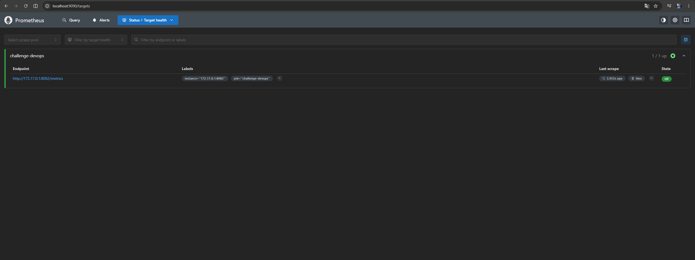
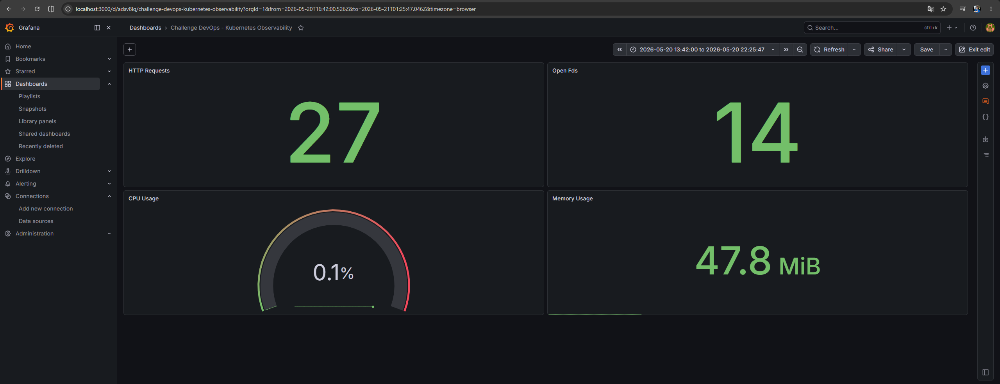
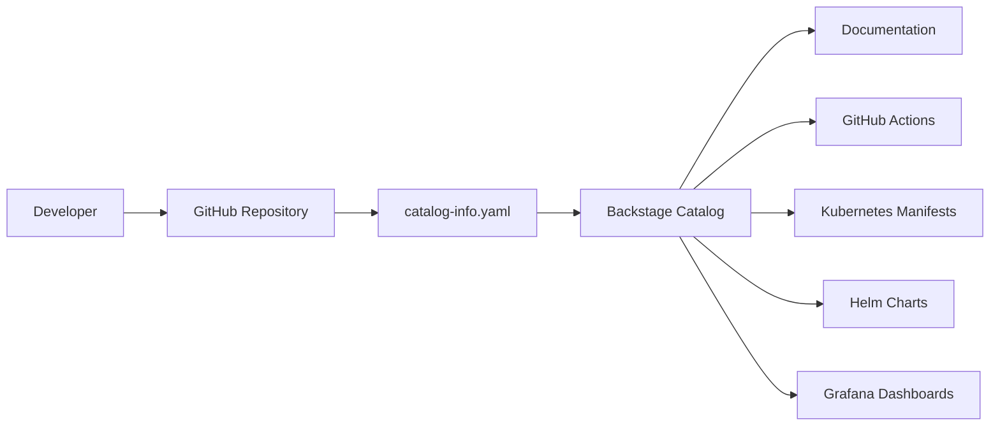
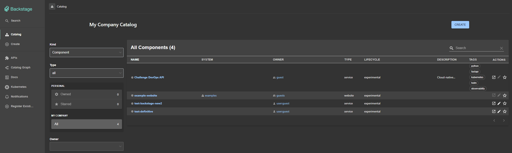
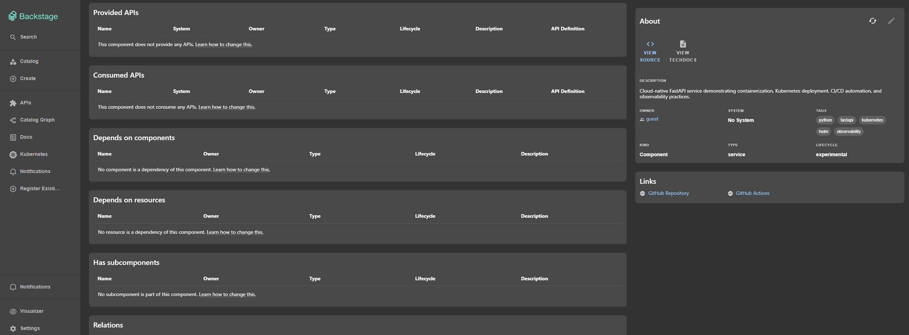

# Challenge DevOps API

Este repositório contém um pequeno serviço FastAPI construído como um desafio DevOps. O objetivo é demonstrar:

- execução local em Python
- containerização com Docker
- orquestração com Docker Compose e Kubernetes
- implantação parametrizada com Helm
- observabilidade com Prometheus e Grafana
- fluxo de qualidade com `Makefile`, `ruff`, `black` e `pre-commit`

## Requisitos

- Python 3.12+
- pip
- Docker
- Docker Compose
- kubectl
- Helm 3
- Git

## Fluxo de desenvolvimento

### 1. Criar ambiente e instalar ferramentas

```bash
make dev-setup
```

Esse target cria `app/.venv` e instala as ferramentas de desenvolvimento necessárias:
- `ruff`
- `black`
- `pre-commit`

### 2. Formatar o código

```bash
make fmt
```

### 3. Fazer análise estática

```bash
make lint
```

### 4. Instalar hooks de commit

```bash
make precommit-install
```

### 5. Executar todos os hooks manualmente

```bash
make precommit-run
```

## Comandos principais do Makefile

```bash
make help
make install
make test
make validate
make run
make docker-build
make docker-run
make compose-up
make compose-down
make kube-apply
make helm-install
make kube-port-forward
make check
make trivy
make helm-lint
make helm-template
```

## Execução local em Python

```bash
make install
make run
```

Ou diretamente:

```bash
cd app
python -m venv .venv
source .venv/bin/activate
pip install -r requirements.txt
uvicorn main:app --host 0.0.0.0 --port 8000
```

A aplicação fica disponível em `http://localhost:8000`.

## Docker

```bash
make docker-build
make docker-run
```

## Docker Compose

```bash
make compose-up
make compose-logs
make compose-down
```

## Kubernetes

### Aplicar manifests

```bash
make kube-apply
```

### Fazer port-forward para expor a aplicação em 8082

```bash
make kube-port-forward
```

### Instalar via Helm

```bash
make helm-install
make helm-upgrade
```

## Observabilidade

A aplicação expõe métricas em `/metrics` e health check em `/health`.

O endpoint de métricas é implementado em `app/api/routes.py`:

```python
@router.get("/metrics")
async def metrics():
    return Response(
        generate_latest(),
        media_type="text/plain"
    )
```

### Prometheus Dashboard



### Grafana Dashboard



O contador principal está definido em `app/observability/metrics.py` e é incrementado no endpoint `/`.

## Security Scanning

Container image vulnerability scanning is implemented using Trivy to validate the security posture of the generated Docker image.

The security workflow is integrated into both:

- local development workflows through the `Makefile`;
- automated CI validation through GitHub Actions.

### Trivy Validation Targets

Run a local vulnerability scan:

```bash
make trivy
```

Run a strict scan that fails on `HIGH` and `CRITICAL` vulnerabilities:

```bash
make trivy FAIL_ON_VULNS=true
```

Equivalent direct Trivy command:

```bash
trivy image \
  --no-progress \
  --severity HIGH,CRITICAL \
  challenge-devops
```

## CI/CD

The repository uses GitHub Actions to automate validation and quality assurance workflows.

The CI/CD pipeline validates the application during pushes and pull requests targeting the `main` branch.

### Automated Pipeline Stages

The pipeline currently performs:

- Python dependency installation;
- application import validation;
- automated pytest execution;
- Ruff lint validation;
- Black formatting validation;
- Docker image build validation;
- Trivy container vulnerability scanning.

### GitHub Actions Workflow

The main workflow is defined in:

```text
.github/workflows/ci.yml
```

### Full Validation Workflow

```bash
make check
```

Run the complete validation workflow in strict mode:

```bash
make check STRICT=true
```

### CI/CD Goals

The pipeline was designed to:

- validate application integrity before deployment;
- standardize development workflows;
- reduce manual validation steps;
- improve code quality and operational consistency;
- integrate DevSecOps validation into the development lifecycle.

## Backstage Integration

The project includes Backstage catalog integration using `catalog-info.yaml`.

The service was registered in a local Backstage software catalog to demonstrate platform engineering and service catalog capabilities.

The integration enables:

- centralized service discovery;
- metadata standardization;
- ownership and lifecycle management;
- integration with GitHub repositories and CI/CD pipelines;
- visibility for Kubernetes and Helm deployment assets.

### Backstage Catalog Metadata

The Backstage entity defines:

- `kind: Component`
- `type: service`
- `lifecycle: experimental`
- `owner: platform-team`

### Catalog Entity Definition

The catalog metadata is defined in:

```text
backstage/catalog-info.yaml
```

### Registered Technologies

The component includes metadata tags for:

- Python
- FastAPI
- Kubernetes
- Helm
- Observability

### Backstage Runtime Validation

During local Backstage setup validation, compatibility issues were identified with Node.js 18 and 20 due to native dependencies such as 'isolated-vm'.

The local Backstage environment was successfully stabilized using Node.js 22

### Backstage Local Execution

Run the Backstage platform locally:

```bash
yarn start
```

The Backstage frontend is exposed on:

```text
http://localhost:3001
```

The Backstage backend API is exposed on:

```text
http://localhost:7008
```



### Backstage Catalog



### Registered Service Component



### Integration Goals

The Backstage integration was implemented to:

- demonstrate platform engineering practices;
- centralize operational metadata;
- improve service discoverability;
- standardize software catalog management;
- integrate documentation, CI/CD, Kubernetes, and observability resources into a single developer portal.

## Qualidade de código

O arquivo `.pre-commit-config.yaml` foi adicionado para garantir estilo e lint antes do commit:

```yaml
repos:
  - repo: https://github.com/psf/black
    rev: 24.11.0
    hooks:
      - id: black
        language_version: python3

  - repo: https://github.com/astral-sh/ruff-pre-commit
    rev: v0.0.261
    hooks:
      - id: ruff
        args: ["check", "app", "app/tests"]
```

## Estrutura do projeto

```text
app/
  api/
  core/
  observability/
  tests/

deploy/
  compose/
  docker/
  kubernetes/
  helm/challenge-devops/

monitoring/
  prometheus/
  grafana/

docs/
.github/
```

## Observações

- A documentação foi atualizada para refletir os novos comandos e configurações.
- O objetivo do `Makefile` é reduzir repetição e tornar o fluxo de desenvolvimento mais profissional.
- Ferramentas como `black`, `ruff` e `pre-commit` ajudam na consistência sem alterar o comportamento do aplicativo em runtime.
