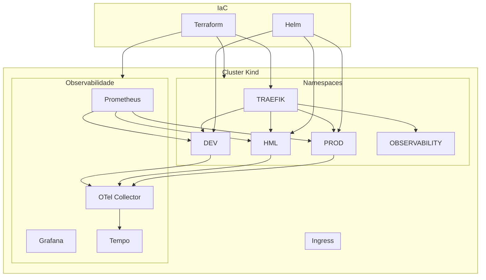

# Challenge DevOps

[](https://github.com/guilhermefranco0013/challenge-devops/actions/workflows/ci.yml)

Plataforma cloud-native de demonstração prática de **DevOps**, **DevSecOps**, **Kubernetes**, **Observabilidade** e **Platform Engineering**.

O projeto simula um ambiente corporativo moderno com múltiplos ambientes (DEV, HML e PROD), promoção imutável de artefatos, infraestrutura como código, segurança em camadas e observabilidade full-stack.

---

## Índice

- [Arquitetura](#arquitetura)
- [Stack Tecnológica](#stack-tecnológica)
- [Pré-requisitos](#pré-requisitos)
- [Estrutura do Projeto](#estrutura-do-projeto)
- [Início Rápido](#início-rápido)
- [Comandos Operacionais](#comandos-operacionais)
- [Ambientes](#ambientes)
- [Terraform](#terraform)
- [Observabilidade](#observabilidade)
- [Segurança](#segurança)
- [CI/CD](#cicd)
- [Qualidade de Código](#qualidade-de-código)
- [Decisões Técnicas](#decisões-técnicas)

---

## Arquitetura



### Princípios Arquiteturais

1. **Terraform** provisiona infraestrutura compartilhada (namespaces, networking, observabilidade).
2. **Helm** entrega aplicações nos namespaces DEV, HML e PROD.
3. **GitHub Actions** orquestra pipelines de CI/CD, segurança e promoção.
4. **Nenhum recurso possui múltiplos responsáveis** — responsabilidade única por ferramenta.
5. **Infrastructure as Code** é a única fonte de verdade — nenhuma alteração manual é permitida.

---

## Stack Tecnológica

| Categoria | Tecnologia | Função |
|---|---|---|
| **Linguagem** | Python 3.12+ | Runtime da aplicação |
| **Framework** | FastAPI | API REST |
| **Servidor ASGI** | Uvicorn | Servidor HTTP assíncrono |
| **Container** | Docker | Empacotamento |
| **Orquestração** | Kubernetes (Kind) | Cluster local |
| **IaC** | Terraform 1.8+ | Infraestrutura como código |
| **Package Manager** | Helm 3 | Deploy da aplicação |
| **Ingress** | Traefik | Roteamento HTTP/HTTPS |
| **Métricas** | Prometheus | Coleta de métricas |
| **Dashboards** | Grafana | Visualização |
| **Tracing** | Tempo + OpenTelemetry | Rastreamento distribuído |
| **Logging** | Structlog | Logging estruturado JSON |
| **Scanner** | Trivy | Análise de vulnerabilidades |
| **SBOM** | CycloneDX | Geração de SBOM |
| **Assinatura** | Cosign | Assinatura de imagens |
| **CI/CD** | GitHub Actions | Automação de pipelines |
| **Linting** | Ruff + Black | Qualidade de código |
| **Catálogo** | Backstage | Service Catalog |
| **Security Scan** | Checkov | IaC security scanning |
| **Static Analysis** | TFLint | Terraform linting |

---

## Pré-requisitos

| Ferramenta | Versão Mínima | Instalação |
|---|---|---|
| Python | 3.12+ | [python.org](https://python.org) |
| Docker | 24+ | [docker.com](https://docker.com) |
| Docker Compose | 2.24+ | Incluso no Docker Desktop |
| Kind | 0.20+ | [kind.sigs.k8s.io](https://kind.sigs.k8s.io) |
| kubectl | 1.28+ | [kubernetes.io](https://kubernetes.io) |
| Helm | 3.14+ | [helm.sh](https://helm.sh) |
| Terraform | 1.8+ | [terraform.io](https://terraform.io) |
| Node.js | 22+ | [nodejs.org](https://nodejs.org) (Backstage) |
| Trivy | 0.50+ | [trivy.dev](https://trivy.dev) |

---

## Estrutura do Projeto

```text
.
├── app/                          # Aplicação FastAPI
│   ├── api/                      #   Rotas da API
│   ├── core/                     #   Configurações
│   ├── observability/            #   Métricas, tracing, logging
│   └── tests/                    #   Testes automatizados
├── backstage/                    # Catálogo Backstage
├── deploy/
│   ├── compose/                  # Docker Compose
│   ├── docker/                   # Dockerfile multi-stage
│   ├── helm/challenge-devops/    # Chart Helm da aplicação
│   ├── kind/                     # Configuração do cluster Kind
│   ├── observability/            # Values dos charts de observabilidade
│   └── traefik/                  # IngressRoutes e config Traefik
├── docs/                         # Documentação e screenshots
├── terraform/                    # Infrastructure as Code
│   ├── bootstrap/                #   Cluster Kind (futuro)
│   ├── environments/             #   Ambientes (dev, hml, prod, etc.)
│   └── modules/                  #   Módulos reutilizáveis
├── .github/                      # GitHub Actions workflows
├── Makefile                      # Automação operacional
└── pyproject.toml                # Configuração Python
```

---

## Início Rápido

### 1. Cluster Kubernetes

```bash
kind create cluster --config deploy/kind/cluster.yml
```

Verificar nodes:

```bash
kubectl get nodes
```

### 2. Infraestrutura (Terraform)

Provisionar toda a infraestrutura compartilhada. A ordem de execução é importante:

```bash
# 1. Namespaces + Governança
cd terraform/environments/dev && terraform init && terraform apply -auto-approve
cd ../hml && terraform init && terraform apply -auto-approve
cd ../prod && terraform init && terraform apply -auto-approve

# 2. Traefik (Ingress Controller)
cd ../traefik && terraform init && terraform apply -auto-approve

# 3. Observabilidade
cd ../observability && terraform init && terraform apply -auto-approve

# 4. Segurança (NetworkPolicies)
cd ../security && terraform init && terraform apply -auto-approve
```

### 3. Aplicação (Helm)

```bash
helm install challenge-devops deploy/helm/challenge-devops --namespace dev --create-namespace
```

### 4. Verificar

```bash
curl localhost:8000/health
```

---

## Comandos Operacionais

Todos os comandos abaixo podem ser executados via **Makefile** ou manualmente.

### 🐍 Aplicação

| Objetivo | Makefile | Comando Manual |
|---|---|---|
| Ambiente virtual | `make venv` | `python -m venv app/.venv` |
| Instalar dependências | `make install` | `pip install -r app/requirements.txt` |
| Executar API local | `make run` | `uvicorn app.main:app --host 0.0.0.0 --port 8000` |
| Executar testes | `make test` | `pytest app/tests -q` |
| Validar aplicação | `make validate` | `pytest app/tests -q && python -c "from app.main import app"` |
| Formatar código | `make fmt` | `black app app/tests` |
| Lint | `make lint` | `ruff check app app/tests` |
| Validação completa | `make check` | `black app app/tests && ruff check app app/tests && pytest -q` |

### 🐳 Docker

| Objetivo | Makefile | Comando Manual |
|---|---|---|
| Construir imagem | `make docker-build` | `docker build -t challenge-devops -f deploy/docker/Dockerfile .` |
| Executar container | `make docker-run` | `docker run --rm -p 8000:8000 challenge-devops` |
| Subir Compose | `make compose-up` | `docker compose -f deploy/compose/docker-compose.yml up --build -d` |
| Logs Compose | `make compose-logs` | `docker compose -f deploy/compose/docker-compose.yml logs --follow` |
| Parar Compose | `make compose-down` | `docker compose -f deploy/compose/docker-compose.yml down` |

### ☸️ Kubernetes + Helm

| Objetivo | Makefile | Comando Manual |
|---|---|---|
| Validar chart | `make helm-lint` | `helm lint deploy/helm/challenge-devops` |
| Renderizar templates | `make helm-template` | `helm template challenge-devops deploy/helm/challenge-devops` |
| Instalar release | `make helm-install` | `helm install challenge-devops deploy/helm/challenge-devops -n dev --create-namespace` |
| Atualizar release | `make helm-upgrade` | `helm upgrade challenge-devops deploy/helm/challenge-devops -n dev --reuse-values` |
| Remover release | `make helm-uninstall` | `helm uninstall challenge-devops -n dev` |
| Status do namespace | `make kube-status` | `kubectl get all -n dev` |
| Port-forward | `make port-forward` | `kubectl port-forward svc/challenge-devops-service 8082:80 -n dev` |
| Logs do pod | `make kube-logs` | `kubectl logs -f deployment/challenge-devops -n dev` |
| Listar pods | `make kube-debug` | `kubectl get pods -o wide -n dev` |

### 🔐 Segurança

| Objetivo | Makefile | Comando Manual |
|---|---|---|
| Trivy (HIGH,CRITICAL) | `make trivy` | `trivy image --no-progress --severity HIGH,CRITICAL challenge-devops` |
| Trivy (modo estrito) | `make trivy FAIL_ON_VULNS=true` | `trivy image --no-progress --exit-code 1 --severity HIGH,CRITICAL challenge-devops` |
| Terraform fmt | — | `terraform fmt -recursive` |
| Terraform validate | — | `terraform validate` |
| TFLint | — | `tflint --config=terraform/.tflint.hcl terraform/environments/dev/` |
| Checkov | — | `checkov -d terraform/` |

### 🧹 Limpeza

| Objetivo | Makefile | Comando Manual |
|---|---|---|
| Limpar cache Python | `make clean` | `find . -type d -name "__pycache__" -exec rm -rf {} +` |

---

## Ambientes

A plataforma possui **5 namespaces** no cluster Kind, cada um com seu próprio estado Terraform:

| Ambiente | Namespace | Responsabilidade |
|---|---|---|
| **DEV** | `dev` | Desenvolvimento da aplicação |
| **HML** | `hml` | Homologação da aplicação |
| **PROD** | `prod` | Produção da aplicação |
| **OBSERVABILITY** | `observability` | Stack de observabilidade (Prometheus, Grafana, Tempo, OTel) |
| **TRAEFIK** | `traefik` | Ingress Controller e roteamento |

Cada namespace possui:

- ✅ **Namespace** gerenciado por Terraform
- ✅ **ResourceQuota + LimitRange** (governança)
- ✅ **NetworkPolicies** (Default Deny + Allow Rules)
- 🔄 **GHCR Pull Secret** (implementado, aguardando credenciais)

---

## Terraform

O Terraform é a **única fonte de verdade** para toda a infraestrutura compartilhada da plataforma.

### Estrutura

```text
terraform/
├── .checkov.yml              # Configuração do Checkov (IaC security)
├── .tflint.hcl               # Configuração do TFLint
├── bootstrap/                # Cluster Kind (futuro)
├── environments/
│   ├── dev/                  # Namespace DEV + Governance
│   ├── hml/                  # Namespace HML + Governance
│   ├── prod/                 # Namespace PROD + Governance
│   ├── observability/        # Prometheus, Grafana, Tempo, OTel
│   ├── traefik/              # Traefik Ingress Controller
│   └── security/             # NetworkPolicies + GHCR Secret
└── modules/
    ├── namespace/            # Criação de namespaces
    ├── governance/           # ResourceQuota + LimitRange
    ├── platform/             # Traefik (via Helm Provider)
    ├── observability/        # Stack de observabilidade (via Helm Provider)
    └── security/             # NetworkPolicies + GHCR Pull Secret
```

### Módulos

| Módulo | Provider | Recursos |
|---|---|---|
| **namespace** | kubernetes | Namespace, labels, annotations |
| **governance** | kubernetes | ResourceQuota, LimitRange |
| **platform** | helm | Traefik (Ingress Controller) |
| **observability** | helm | Prometheus, Grafana, Tempo, OTel Collector |
| **security** | kubernetes | NetworkPolicies, GHCR Pull Secret |

### Ordem de Execução

Os environments possuem dependência entre si. A ordem correta é:

1. **DEV, HML, PROD** — namespaces + governança (sem dependências entre si)
2. **TRAEFIK** — depende dos namespaces (NetworkPolicies serão aplicadas depois)
3. **OBSERVABILITY** — depende do namespace observability + traefik (ingress para acesso)
4. **SECURITY** — depende de TODOS os namespaces existentes (aplica NetworkPolicies)

---

## Observabilidade

### Componentes

| Componente | Função | Acesso |
|---|---|---|
| **Prometheus** | Coleta de métricas | [prometheus.localhost](http://prometheus.localhost) |
| **Grafana** | Dashboards e visualização | [grafana.localhost](http://grafana.localhost) |
| **Tempo** | Armazenamento de traces | [tempo.localhost](http://tempo.localhost) |
| **OpenTelemetry Collector** | Recepção e exportação de telemetria | Interno (gRPC/HTTP) |

### Métricas da Aplicação

A aplicação FastAPI expõe:

| Endpoint | Descrição |
|---|---|
| `/` | Endpoint principal |
| `/health` | Healthcheck |
| `/metrics` | Métricas Prometheus |

### Logging Estruturado

```json
{
  "event": "healthcheck_called",
  "level": "info",
  "timestamp": "2026-06-18T16:00:00Z",
  "logger": "app.observability.logging",
  "correlation_id": "abc-123-def-456"
}
```

### Dashboards

| Ferramenta | Screenshot |
|---|---|
| Prometheus Targets |  |
| Grafana Dashboard |  |

---

## Segurança

### NetworkPolicies (Zero Trust)

A plataforma opera sob modelo **Default Deny** em todos os namespaces:

```text
Todo tráfego negado
    ↓
Liberado apenas:
    ├── DNS (porta 53 UDP → kube-system)
    ├── Traefik → Aplicações (porta 8000 TCP)
    ├── Prometheus → Aplicações (porta 8000 TCP, scraping)
    └── Aplicações → OTel Collector (portas 4317/4318 TCP)
```

### GHCR Pull Secret

Secret do tipo `docker-registry` para consumo de imagens privadas do GitHub Container Registry. Implementado via Terraform, desabilitado por padrão até que as credenciais sejam configuradas.

### Análise de Vulnerabilidades

- **Trivy**: scan de vulnerabilidades na imagem Docker (severidade HIGH/CRITICAL)
- **Checkov**: scan de segurança no código Terraform
- **TFLint**: lint específico para Terraform

---

## CI/CD

O pipeline automatizado via GitHub Actions executa:

```text
Código
  ↓
Ruff + Black + Isort
  ↓
Pytest
  ↓
Build Docker
  ↓
Trivy (vulnerabilidades)
  ↓
SBOM (CycloneDX)
  ↓
Cosign (assinatura)
  ↓
Promoção: DEV → HML → PROD
  ↓
Helm Deploy + Health Check
```

---

## Qualidade de Código

| Ferramenta | Função | Comando |
|---|---|---|
| **Ruff** | Linter Python | `ruff check app/` |
| **Black** | Formatador Python | `black app/` |
| **Isort** | Organizador de imports | `isort app/` |
| **Pytest** | Testes automatizados | `pytest app/tests -q` |
| **Pre-Commit** | Hooks de validação | `pre-commit run --all-files` |

---

## Integração com Backstage

O projeto possui integração com Backstage via `backstage/catalog-info.yaml`, centralizando metadados operacionais do serviço.

```bash
yarn start
```

Frontend: `http://localhost:3001`
Backend: `http://localhost:7008`

---

## Decisões Técnicas

| Decisão | Justificativa |
|---|---|
| **FastAPI** | Leveza, tipagem moderna, integração nativa com ASGI |
| **Docker multi-stage** | Imagens menores e mais seguras |
| **Kind** | Cluster Kubernetes local reproduzível |
| **Terraform + Helm** | Separação clara entre infraestrutura e aplicação |
| **Default Deny NetworkPolicies** | Modelo Zero Trust desde o início |
| **Structlog** | Logging estruturado JSON para integração com ferramentas de observabilidade |
| **Trivy + SBOM + Cosign** | Supply chain security: scan, inventário e assinatura |
| **Backstage** | Service Catalog e Platform Engineering |

---

## Referências

- [SDD - Documento de Design](.spec/sdd/project-context.md)
- [Arquitetura do Sistema](.spec/architecture/architecture.md)
- [Checkov Security Scan](https://www.checkov.io)
- [TFLint](https://github.com/terraform-linters/tflint)