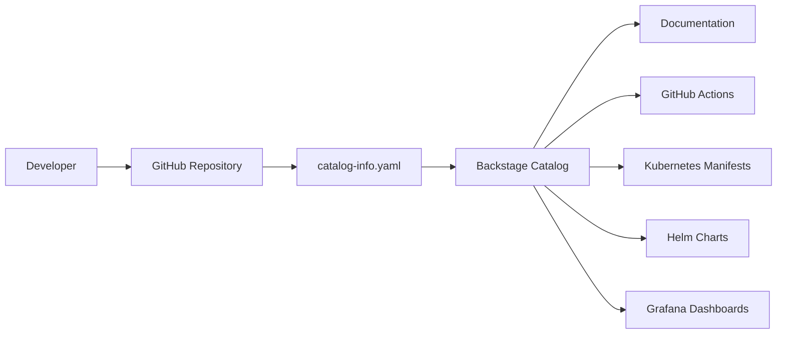

# Challenge DevOps API

Este repositório contém um pequeno serviço desenvolvido com FastAPI como parte de um desafio DevOps. O projeto foi estruturado para demonstrar práticas modernas de desenvolvimento, observabilidade, containerização, automação e orquestração utilizando ferramentas amplamente adotadas em ambientes cloud-native.

---

# Objetivos do projeto

O projeto demonstra:

- execução local em Python;
- containerização com Docker;
- orquestração com Docker Compose e Kubernetes;
- gerenciamento declarativo com Helm;
- observabilidade com Prometheus e Grafana;
- logging estruturado com Structlog;
- métricas Prometheus;
- automação operacional com Makefile;
- validação de qualidade com Ruff, Black e Pre-Commit;
- análise de vulnerabilidades com Trivy;
- integração CI/CD com GitHub Actions;
- integração de catálogo com Backstage.

---

# Requisitos

Antes de iniciar, instale:

- Python 3.12+
- pip
- Docker
- Docker Compose
- Kind (para Kubernetes local)
- kubectl
- Helm 3
- Git
- Trivy
- Node.js 22+ (para Backstage)
- Yarn

---

# Estrutura do projeto

```text
app/
  api/
  core/
  observability/
  tests/

deploy/
  compose/
  docker/
  kubernetes/
  helm/challenge-devops/

monitoring/
  prometheus/
  grafana/

docs/
.github/
```

---

# Arquitetura

O projeto utiliza:

- FastAPI para exposição da API REST;
- Uvicorn como servidor ASGI;
- Structlog para logging estruturado em JSON;
- Prometheus para coleta de métricas;
- Grafana para dashboards e observabilidade;
- Docker para containerização;
- Kubernetes para orquestração;
- Helm para gerenciamento declarativo;
- GitHub Actions para CI/CD;
- Backstage para catálogo de serviços.

---

# Endpoints disponíveis

| Endpoint | Descrição |
|---|---|
| `/` | Endpoint principal da aplicação |
| `/health` | Healthcheck da aplicação |
| `/metrics` | Métricas Prometheus |

---

# Fluxo de desenvolvimento

## 1. Criar ambiente virtual

### Via Makefile

```bash
make venv
```

### Comando manual equivalente

```bash
cd app
python -m venv .venv
```

---

## 2. Ativar ambiente virtual

```bash
source app/.venv/bin/activate
```

---

## 3. Instalar dependências

### Via Makefile

```bash
make install
```

### Comando manual equivalente

```bash
pip install -r app/requirements.txt
```

---

## 4. Formatar código

### Via Makefile

```bash
make fmt
```

### Comando manual equivalente

```bash
black app app/tests
```

---

## 5. Executar lint

### Via Makefile

```bash
make lint
```

### Comando manual equivalente

```bash
ruff check app app/tests
```

---

## 6. Instalar hooks de pre-commit

### Via Makefile

```bash
make precommit-install
```

### Comando manual equivalente

```bash
pre-commit install
```

---

## 7. Executar hooks manualmente

### Via Makefile

```bash
make precommit-run
```

### Comando manual equivalente

```bash
pre-commit run --all-files
```

---

# Comandos Operacionais

| Área | Objetivo | Makefile | Comando manual equivalente |
|---|---|---|---|
| 🐍 Python | Executar API localmente | `make run` | `uvicorn app.main:app --host 0.0.0.0 --port 8000` |
| 🐍 Python | Executar testes | `make test` | `pytest app/tests -q` |
| 🐍 Python | Validar aplicação | `make validate` | `python -c "from app.main import app" && pytest app/tests -q` |
| 🐳 Docker | Construir imagem Docker | `make docker-build` | `docker build -t challenge-devops -f deploy/docker/Dockerfile .` |
| 🐳 Docker | Executar container Docker | `make docker-run` | `docker run --rm -p 8000:8000 challenge-devops` |
| 🐳 Docker Compose | Subir ambiente | `make compose-up` | `docker compose -f deploy/compose/docker-compose.yml up --build -d` |
| 🐳 Docker Compose | Visualizar logs | `make compose-logs` | `docker compose -f deploy/compose/docker-compose.yml logs --follow` |
| 🐳 Docker Compose | Parar ambiente | `make compose-down` | `docker compose -f deploy/compose/docker-compose.yml down` |
| ☸️ Kubernetes | Aplicar manifests | `make kube-apply` | `kubectl apply -f deploy/kubernetes` |
| ☸️ Kubernetes | Remover recursos | `make kube-delete` | `kubectl delete -f deploy/kubernetes --ignore-not-found` |
| ☸️ Kubernetes | Visualizar recursos | `make kube-status` | `kubectl get all -n challenge-devops` |
| ☸️ Kubernetes | Fazer port-forward | `make port-forward` | `kubectl port-forward svc/challenge-devops-service 8082:80 -n challenge-devops` |
| ☸️ Kubernetes | Visualizar logs | `make kube-logs` | `kubectl logs -f deployment/challenge-devops -n challenge-devops` |
| ☸️ Kubernetes | Visualizar pods | `make kube-debug` | `kubectl get pods -o wide -n challenge-devops` |
| 📦 Helm | Validar chart Helm | `make helm-lint` | `helm lint deploy/helm/challenge-devops` |
| 📦 Helm | Renderizar templates Helm | `make helm-template` | `helm template challenge-devops deploy/helm/challenge-devops --namespace challenge-devops` |
| 📦 Helm | Instalar release Helm | `make helm-install` | `helm install challenge-devops deploy/helm/challenge-devops --namespace challenge-devops --create-namespace` |
| 📦 Helm | Atualizar release Helm | `make helm-upgrade` | `helm upgrade challenge-devops deploy/helm/challenge-devops --namespace challenge-devops --reuse-values` |
| 📦 Helm | Remover release Helm | `make helm-uninstall` | `helm uninstall challenge-devops --namespace challenge-devops` |
| 🔐 Segurança | Executar análise Trivy | `make trivy` | `trivy image --no-progress --severity HIGH,CRITICAL challenge-devops` |
| 🔐 Segurança | Executar análise rígida Trivy | `make trivy FAIL_ON_VULNS=true` | `trivy image --no-progress --exit-code 1 --severity HIGH,CRITICAL challenge-devops` |
| 🔄 CI/CD | Executar validação completa | `make check` | `black app app/tests && ruff check app app/tests && pytest app/tests -q` |
| 🧹 Limpeza | Limpar cache e arquivos temporários | `make clean` | `find . -type d -name "__pycache__" -exec rm -rf {} +` |
| 📊 Observabilidade | Verificar healthcheck | — | `curl localhost:8000/health` |
| 📊 Observabilidade | Verificar métricas Prometheus | — | `curl localhost:8000/metrics` |
| 📊 Observabilidade | Verificar endpoint principal | — | `curl localhost:8000/` |

---

# Execução local em Python

## Via Makefile

```bash
make install
make run
```

---

## Comando manual equivalente

```bash
cd app

python -m venv .venv

source .venv/bin/activate

pip install -r requirements.txt

uvicorn main:app --host 0.0.0.0 --port 8000
```

---

# Docker

## Via Makefile

```bash
make docker-build
make docker-run
```

---

## Comandos manuais equivalentes

Construir imagem Docker:

```bash
docker build -t challenge-devops -f deploy/docker/Dockerfile .
```

Executar container localmente:

```bash
docker run --rm -p 8000:8000 challenge-devops
```

---

# Docker Compose

## Via Makefile

```bash
make compose-up
make compose-logs
make compose-down
```

---

## Comandos manuais equivalentes

Subir ambiente:

```bash
docker compose -f deploy/compose/docker-compose.yml up --build -d
```

Visualizar logs:

```bash
docker compose -f deploy/compose/docker-compose.yml logs --follow
```

Parar ambiente:

```bash
docker compose -f deploy/compose/docker-compose.yml down
```

---

# Kubernetes

## Aplicar manifests

### Via Makefile

```bash
make kube-apply
```

### Comando manual equivalente

```bash
kubectl apply -f deploy/kubernetes
```

---

## Fazer port-forward

### Via Makefile

```bash
make port-forward
```

### Comando manual equivalente

```bash
kubectl port-forward svc/challenge-devops-service 8082:80 -n challenge-devops
```

---

## Visualizar logs

### Via Makefile

```bash
make kube-logs
```

### Comando manual equivalente

```bash
kubectl logs -f deployment/challenge-devops -n challenge-devops
```

---

## Visualizar recursos do cluster

### Via Makefile

```bash
make kube-status
```

### Comando manual equivalente

```bash
kubectl get all -n challenge-devops
```

---

# Helm

## Instalar release

### Via Makefile

```bash
make helm-install
```

### Comando manual equivalente

```bash
helm install challenge-devops \
  deploy/helm/challenge-devops \
  --namespace challenge-devops \
  --create-namespace
```

---

## Atualizar release

### Via Makefile

```bash
make helm-upgrade
```

### Comando manual equivalente

```bash
helm upgrade challenge-devops \
  deploy/helm/challenge-devops \
  --namespace challenge-devops \
  --reuse-values
```

---

# Observabilidade

A aplicação expõe:

- métricas Prometheus em `/metrics`;
- healthcheck em `/health`;
- logging estruturado em JSON.

---

## Exemplo de log estruturado

```json
{
  "event": "healthcheck_called",
  "level": "info",
  "timestamp": "2026-05-22T20:00:00Z"
}
```

---

## Métricas Prometheus

O endpoint `/metrics` utiliza:

```python
generate_latest()
```

para exportar métricas compatíveis com Prometheus.

Exemplo:

```text
# HELP requests_total Total requests
# TYPE requests_total counter
requests_total 5.0
```

---

# Dashboards

## Prometheus


---

## Grafana


---

# Análise de Segurança

O projeto utiliza Trivy para análise de vulnerabilidades da imagem Docker.

## Via Makefile

```bash
make trivy
```

---

## Comando manual equivalente

```bash
trivy image \
  --no-progress \
  --severity HIGH,CRITICAL \
  challenge-devops
```

---

## Execução rígida

```bash
make trivy FAIL_ON_VULNS=true
```

---

# CI/CD

O projeto utiliza GitHub Actions para automação de validações.

---

## Pipeline automatizado

O pipeline executa:

- instalação de dependências;
- validação de imports;
- testes automatizados;
- lint com Ruff;
- formatação com Black;
- build Docker;
- análise Trivy.

---

## Workflow principal

```text
.github/workflows/ci.yml
```

---

## Fluxo completo de validação

### Via Makefile

```bash
make check
```

### Execução estrita

```bash
make check STRICT=true
```

---

# Integração com Backstage

O projeto possui integração com Backstage utilizando:

```text
catalog-info.yaml
```

---

## Objetivos da integração

- centralizar metadados operacionais;
- melhorar descoberta de serviços;
- integrar CI/CD;
- integrar Kubernetes e Helm;
- consolidar documentação técnica.

---

## Execução local do Backstage

```bash
yarn start
```

---

## URLs locais

Frontend:

```text
http://localhost:3001
```

Backend:

```text
http://localhost:7008
```

---

# Estrutura do catálogo Backstage



---

# Qualidade de código

O projeto utiliza:

- Ruff;
- Black;
- Pre-Commit;
- Pytest.

---

# Decisões Técnicas

As principais decisões técnicas do projeto foram:

- utilização de FastAPI devido à leveza, tipagem moderna e integração simples com ASGI;
- utilização de Docker multi-stage build para separar dependências de build e runtime da aplicação, permitindo imagens menores, mais seguras e com menor overhead operacional em ambientes Kubernetes;
- utilização de Kubernetes para simular ambiente cloud-native e orquestração distribuída;
- utilização de Helm para gerenciamento declarativo e parametrização dos manifests Kubernetes;
- utilização de Prometheus e Grafana para observabilidade baseada em métricas;
- utilização de Structlog para logging estruturado em JSON;
- utilização de Trivy para validação de vulnerabilidades da imagem Docker;
- utilização de Backstage para demonstração de catálogo de serviços e platform engineering;
- centralização operacional via Makefile para simplificar workflows de desenvolvimento e troubleshooting.

# Observações finais

- O Makefile foi projetado para simplificar operações recorrentes;
- Os comandos manuais equivalentes foram documentados para transparência operacional;
- O projeto segue princípios cloud-native;
- A stack foi estruturada para demonstrar práticas modernas de DevOps, SRE e Platform Engineering.