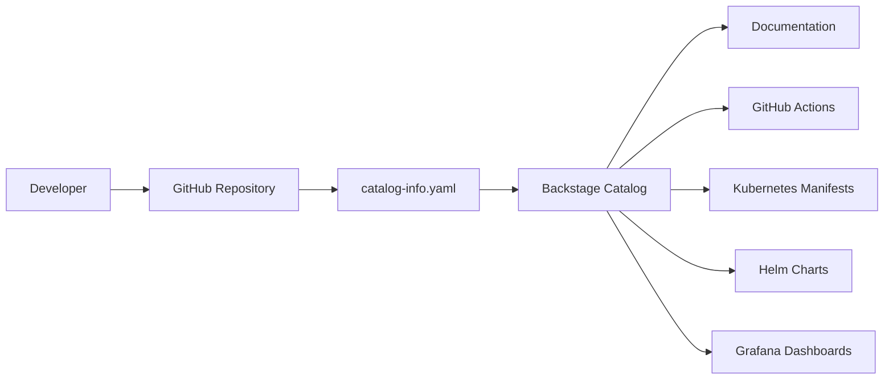

# Backstage Integration

## Purpose

The `backstage/catalog-info.yaml` file should contain metadata for Backstage, enabling the application to be discovered, documented, and managed in a central catalog.

## Expected Structure

A typical Backstage catalog entry includes:

- `apiVersion`: Backstage API version.
- `kind`: entity type, such as `Component`.
- `metadata`: name, description, tags, and owner.
- `spec`: details for `type`, `lifecycle`, `owner`, `system`, `implementsApis`, and `providesApis`.

## Project Usage

In this repository, the Backstage catalog should document:

- the `challenge-devops` service as a backend component;
- the Git repository as the component source;
- the GitHub URL and CI/CD pipeline references;
- deployment information for Kubernetes/Helm;
- technology tags like `python`, `fastapi`, `kubernetes`, `helm`, and `observability`.

## Backstage Integration Flow

## Operational Value

Backstage integration provides:

- faster service discovery and dependency visibility;
- clear operational guidance for development and operations teams;
- direct links to documentation, pipelines, and deployment manifests.

## Current State

Currently, the project does not yet expose service metadata through a populated
`backstage/catalog-info.yaml` entity definition.

### Recommendations

- populate `backstage/catalog-info.yaml` with a `Component` entity for `challenge-devops`.
- link the component to Kubernetes manifests, Helm charts, CI/CD pipelines, and operational documentation.
- include documentation for `owner`, `lifecycle`, and `system`.
- keep the file versioned alongside the service code.
