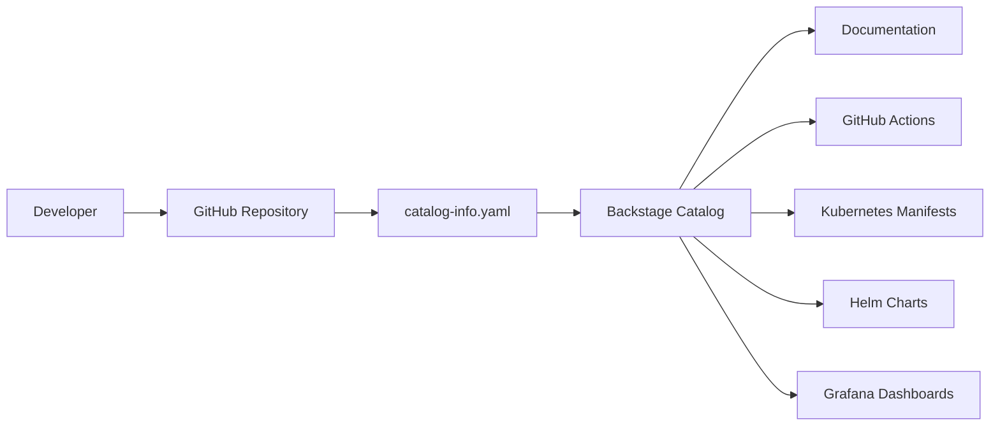

# Backstage Integration

## Purpose

The `backstage/catalog-info.yaml` file should contain metadata for Backstage, enabling the application to be discovered, documented, and managed in a central catalog.

## Expected Structure

A typical Backstage catalog entry includes:

- `apiVersion`: Backstage API version.
- `kind`: entity type, such as `Component`.
- `metadata`: name, description, tags, and owner.
- `spec`: details for `type`, `lifecycle`, `owner`, `system`, `implementsApis`, and `providesApis`.

## Project Usage

In this repository, the Backstage catalog should document:

- the `challenge-devops` service as a backend component;
- the Git repository as the component source;
- the GitHub URL and CI/CD pipeline references;
- deployment information for Kubernetes/Helm;
- technology tags like `python`, `fastapi`, `kubernetes`, `helm`, and `observability`.

## Backstage Integration Flow

## Operational Value

Backstage integration provides:

- faster service discovery and dependency visibility;
- clear operational guidance for development and operations teams;
- direct links to documentation, pipelines, and deployment manifests.

## Current State

The repository currently includes a populated `backstage/catalog-info.yaml`
file describing the `challenge-devops` service as a Backstage component.

The metadata defines ownership, lifecycle, technology tags, and API exposure,
allowing the service to be integrated into a Backstage software catalog.

## Local Environment Validation

During the Backstage local setup validation, compatibility issues were identified with Node.js 18 and 20 due to native dependencies such as `isolated-vm`.

The environment was successfully stabilized using Node.js 22, which provided compatibility with the current Backstage dependency tree and Yarn build process.

This validation process demonstrated the dependency requirements and runtime expectations of modern Backstage environments.

### Recommendations

- populate `backstage/catalog-info.yaml` with a `Component` entity for `challenge-devops`.
- link the component to Kubernetes manifests, Helm charts, CI/CD pipelines, and operational documentation.
- include documentation for `owner`, `lifecycle`, and `system`.
- keep the file versioned alongside the service code.
