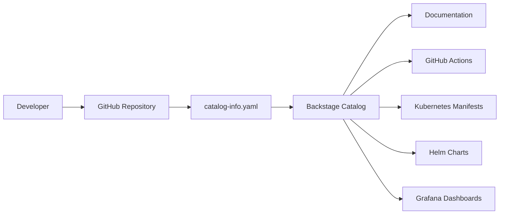

# Integração com Backstage

## Visão geral

O projeto `challenge-devops` possui integração com o Backstage utilizando o arquivo:

```text
backstage/catalog-info.yaml
```

O objetivo da integração é centralizar metadados operacionais, documentação técnica e informações de implantação em um catálogo unificado de serviços.

A integração com o Backstage permite que a aplicação seja descoberta, documentada e gerenciada de forma padronizada dentro de uma plataforma de engenharia interna.

---

# Objetivos da integração

A integração com o Backstage foi implementada para:

- centralizar informações operacionais do serviço;
- melhorar a descoberta de aplicações;
- padronizar metadados técnicos;
- integrar documentação, CI/CD e deployment;
- consolidar informações de Kubernetes e Helm;
- demonstrar práticas de Platform Engineering;
- facilitar governança e ownership de serviços.

---

# Estrutura esperada do catalog-info.yaml

O arquivo `catalog-info.yaml` deve conter metadados estruturados para o catálogo Backstage.

Uma entidade típica inclui:

| Campo | Descrição |
|---|---|
| `apiVersion` | Versão da API do Backstage |
| `kind` | Tipo da entidade, como `Component` |
| `metadata` | Nome, descrição, tags e owner |
| `spec` | Tipo do serviço, lifecycle, owner e APIs |

---

# Uso no projeto

Neste repositório, o catálogo Backstage documenta:

- o serviço `challenge-devops` como um componente backend;
- o repositório GitHub como origem do componente;
- referências para CI/CD via GitHub Actions;
- manifests Kubernetes e charts Helm;
- metadados operacionais da aplicação;
- tags tecnológicas como:
  - `python`
  - `fastapi`
  - `kubernetes`
  - `helm`
  - `observability`

---

# Estrutura da entidade Backstage

O componente foi registrado utilizando:

```yaml
kind: Component
type: service
lifecycle: experimental
owner: platform-team
```

---

# Fluxo de integração



---

# Valor operacional

A integração com o Backstage fornece:

- descoberta centralizada de serviços;
- visibilidade de dependências;
- padronização de ownership;
- rastreabilidade operacional;
- acesso rápido à documentação;
- integração com pipelines CI/CD;
- acesso centralizado a recursos Kubernetes e Helm;
- visibilidade de dashboards e observabilidade.

---

# Estado atual da integração

O repositório atualmente possui um arquivo:

```text
backstage/catalog-info.yaml
```

preenchido com os metadados do serviço `challenge-devops`.

A entidade registrada define:

- ownership;
- lifecycle;
- tags tecnológicas;
- exposição de APIs;
- informações operacionais.

Isso permite que o serviço seja integrado diretamente ao catálogo Backstage.

---

# Validação do ambiente local

Durante a validação do ambiente Backstage local, foram identificados problemas de compatibilidade utilizando:

- Node.js 18;
- Node.js 20.

As incompatibilidades ocorreram devido a dependências nativas, principalmente:

```text
isolated-vm
```

O ambiente foi estabilizado com sucesso utilizando:

```text
Node.js 22
```

Essa versão apresentou compatibilidade adequada com:

- dependências atuais do Backstage;
- build do Yarn;
- runtime local da plataforma.

---

# Execução local do Backstage

## Instalar dependências

```bash
yarn install
```

---

## Executar ambiente local

```bash
yarn start
```

---

# URLs locais

## Frontend

```text
http://localhost:3001
```

---

## Backend

```text
http://localhost:7008
```

---

# Recomendações operacionais

Recomenda-se:

- manter o `catalog-info.yaml` versionado junto ao código da aplicação;
- documentar ownership e lifecycle do serviço;
- vincular manifests Kubernetes e charts Helm;
- integrar pipelines GitHub Actions;
- manter tags tecnológicas atualizadas;
- incluir documentação operacional da aplicação;
- padronizar entidades Backstage para todos os serviços da plataforma.

---

# Benefícios da abordagem

A utilização do Backstage neste projeto demonstra:

- práticas modernas de Platform Engineering;
- centralização de metadados operacionais;
- melhoria na experiência do desenvolvedor;
- padronização de serviços;
- integração entre documentação, CI/CD e infraestrutura;
- aumento de visibilidade operacional em ambientes Kubernetes.

---

# Tecnologias integradas

O componente Backstage referencia tecnologias como:

- Python;
- FastAPI;
- Docker;
- Kubernetes;
- Helm;
- Prometheus;
- Grafana;
- GitHub Actions;
- Observabilidade;
- DevSecOps.

---

# Objetivo arquitetural

A integração foi projetada para consolidar:

- documentação técnica;
- recursos Kubernetes;
- deployment Helm;
- pipelines CI/CD;
- observabilidade;
- ownership operacional;

em um único portal centralizado para engenharia de plataforma.