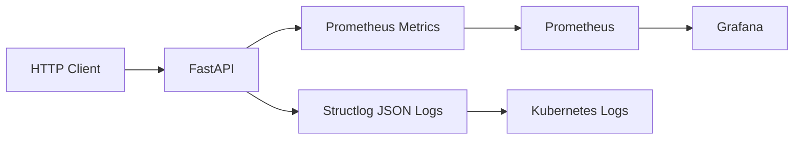

# Observabilidade — Challenge DevOps API

## Visão geral

O projeto `challenge-devops` implementa uma arquitetura de observabilidade baseada em:

- métricas Prometheus;
- dashboards Grafana;
- logging estruturado em JSON;
- healthchecks operacionais;
- integração Kubernetes.

O objetivo é fornecer:

- monitoramento operacional;
- troubleshooting;
- visibilidade da aplicação;
- coleta de métricas runtime;
- análise de comportamento da API.

---

# Arquitetura de observabilidade

A stack observável do projeto utiliza:

| Ferramenta | Objetivo |
|---|---|
| Prometheus | Coleta de métricas |
| Grafana | Dashboards e visualização |
| Structlog | Logging estruturado |
| FastAPI | Exposição de métricas e healthchecks |

---

# Estrutura de observabilidade

Os componentes estão organizados em:

```text
app/observability/
monitoring/prometheus/
monitoring/grafana/
```

---

# Fluxo de observabilidade

```mermaid
flowchart LR

    Client[HTTP Client] --> FastAPI[FastAPI Application]

    FastAPI --> Metrics[/metrics Endpoint]

    Metrics --> Prometheus[Prometheus Scraping]

    Prometheus --> Grafana[Grafana Dashboard]

    FastAPI --> Logs[Structured JSON Logs]
```

---

# Métricas Prometheus

## Visão geral

A aplicação expõe métricas Prometheus através do endpoint:

```text
/metrics
```

implementado em:

```text
app/api/routes.py
```

---

# Implementação das métricas

As métricas são definidas em:

```text
app/observability/metrics.py
```

---

# Métrica principal

Atualmente o projeto utiliza:

```text
app_requests_total
```

para contabilizar requisições HTTP da aplicação.

---

# Exemplo de implementação

```python
REQUEST_COUNTER.inc()
```

---

# Exemplo de métrica exportada

```text
# HELP app_requests_total Total requests
# TYPE app_requests_total counter

app_requests_total 10.0
```

---

# Endpoint de métricas

O endpoint responsável pela exposição Prometheus:

```python
@router.get("/metrics")
async def metrics():

    return Response(
        generate_latest(),
        media_type="text/plain"
    )
```

---

# Validação local

## Executar aplicação

```bash
make run
```

---

## Verificar endpoint de métricas

```bash
curl localhost:8000/metrics
```

---

# Prometheus

## Visão geral

O Prometheus foi configurado para coletar métricas da aplicação utilizando scraping HTTP.

A configuração está localizada em:

```text
monitoring/prometheus/prometheus.yml
```

---

# Configuração atual

## Job configurado

```yaml
job_name: challenge-devops
```

---

## Endpoint de métricas

```yaml
metrics_path: /metrics
```

---

## Target atual

```yaml
targets:
  - 172.17.0.1:8082
```

---

# Observação importante

O target atual utiliza:

```text
Docker Bridge Networking
```

para acessar localmente a aplicação Kubernetes exposta via:

```text
kubectl port-forward
```

durante validações locais.

---

# Fluxo operacional atual

```text
Prometheus
     ↓
172.17.0.1:8082
     ↓
kubectl port-forward
     ↓
Kubernetes Service :80
     ↓
Pod :8000
     ↓
FastAPI
```

---

# Melhorias recomendadas

O target atual ainda depende de configuração manual/local.

Em ambientes produtivos recomenda-se:

- Kubernetes Service Discovery;
- Prometheus Operator;
- ServiceMonitor;
- DNS interno Kubernetes;
- Ingress observável.

---

# Grafana

## Visão geral

O Grafana é utilizado para visualização das métricas Prometheus.

Os dashboards estão versionados no repositório em:

```text
monitoring/grafana/dashboards/
```

---

# Dashboard principal

```text
challenge-devops-observability-dashboard.json
```

---

# Métricas visualizadas

O dashboard atualmente inclui:

| Métrica | Objetivo |
|---|---|
| `app_requests_total` | Total de requisições HTTP |
| `process_open_fds` | File descriptors abertos |
| CPU runtime metrics | Uso de CPU |
| Memory runtime metrics | Uso de memória |

---

# Integração Prometheus → Grafana

O Grafana utiliza o Prometheus como datasource principal para:

- métricas HTTP;
- métricas runtime;
- métricas de processo;
- telemetria operacional.

---

# Serviços locais

| Serviço | Porta |
|---|---|
| FastAPI | `8000` |
| Prometheus | `9090` |
| Grafana | `3000` |

---

# Acesso local

## Prometheus

```text
http://localhost:9090
```

---

## Grafana

```text
http://localhost:3000
```

---

# Docker Compose observável

A stack local observável é executada via:

```bash
make compose-up
```

---

# Comando manual equivalente

```bash
docker compose -f deploy/compose/docker-compose.yml up --build -d
```

---

# Logging estruturado

## Visão geral

O projeto utiliza:

```text
Structlog
```

para geração de logs estruturados em JSON.

A configuração está localizada em:

```text
app/observability/logging.py
```

---

# Objetivos do logging

O logging estruturado foi implementado para:

- troubleshooting;
- observabilidade;
- integração Kubernetes;
- integração Loki/Grafana;
- padronização cloud-native.

---

# Fluxo de logs

```text
FastAPI
   ↓
Structlog
   ↓
stdout/stderr
   ↓
Docker
   ↓
Kubernetes
   ↓
kubectl logs
```

---

# Exemplo de log estruturado

```json
{
  "event": "healthcheck_called",
  "level": "info",
  "timestamp": "2026-05-22T20:00:00Z"
}
```

---

# Visualização de logs Kubernetes

## Via Makefile

```bash
make kube-logs
```

---

## Comando manual equivalente

```bash
kubectl logs -f deployment/challenge-devops -n challenge-devops
```

---

# Healthchecks

## Endpoint operacional

A aplicação expõe:

```text
/health
```

para:

- readinessProbe;
- livenessProbe;
- monitoramento;
- validação operacional.

---

# Exemplo de resposta

```json
{
  "status": "ok"
}
```

---

# Fluxo observável completo



---

# Recursos observáveis implementados

## Atualmente o projeto já possui

- endpoint `/metrics`;
- endpoint `/health`;
- Prometheus scraping;
- dashboards Grafana;
- logging estruturado;
- métricas runtime;
- observabilidade Docker Compose;
- observabilidade Kubernetes.

---

# Melhorias futuras recomendadas

Adicionar:

- Loki;
- Promtail;
- OpenTelemetry;
- tracing distribuído;
- alertas Grafana;
- provisioning automático;
- ServiceMonitor Kubernetes;
- métricas de latência;
- métricas de erro;
- SLO/SLI.

---

# Objetivos futuros de maturidade

Evoluir a stack para:

- observabilidade enterprise-grade;
- telemetria distribuída;
- troubleshooting avançado;
- monitoramento Kubernetes nativo;
- integração GitOps.

---

# Conclusão técnica

A arquitetura de observabilidade atual demonstra práticas modernas alinhadas com:

- DevOps;
- SRE;
- Cloud-Native;
- Kubernetes;
- Platform Engineering.

O projeto já implementa:

- métricas Prometheus;
- dashboards Grafana;
- logging estruturado;
- integração Kubernetes;
- healthchecks operacionais;
- monitoramento básico da aplicação.

A solução fornece uma base sólida para evolução futura da stack observável em ambientes produtivos.