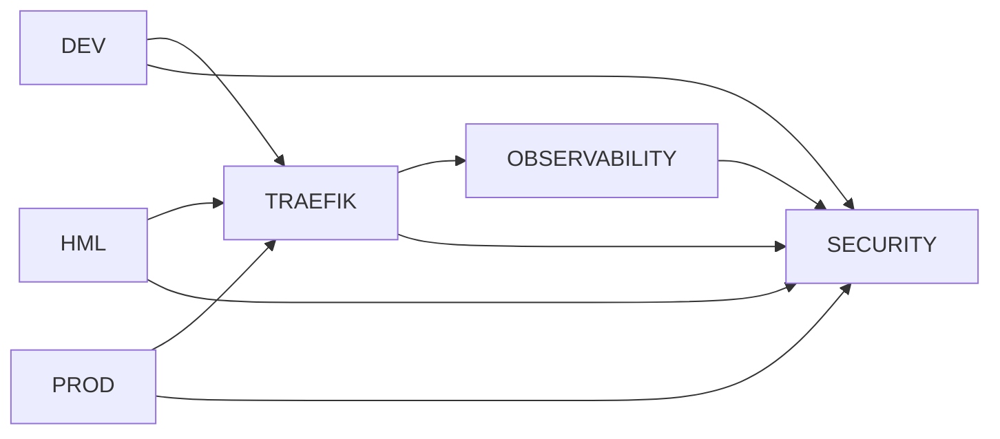

# Terraform Environments

## Objetivo

Cada ambiente representa um conjunto de recursos de infraestrutura da plataforma challenge-devops gerenciados pelo Terraform.

Cada ambiente possui **estado isolado** (backend local) e deve ser executado de forma independente, respeitando a ordem de dependência entre eles.

---

## Ambientes

| Ambiente | Namespace | Módulos Utilizados | Provider |
|---|---|---|---|
| [DEV](./dev) | `dev` | namespace, governance | kubernetes |
| [HML](./hml) | `hml` | namespace, governance | kubernetes |
| [PROD](./prod) | `prod` | namespace, governance | kubernetes |
| [TRAEFIK](./traefik) | `traefik` | namespace, governance, platform | kubernetes, helm |
| [OBSERVABILITY](./observability) | `observability` | namespace, governance, observability | kubernetes, helm |
| [SECURITY](./security) | `dev`, `hml`, `prod`, `observability`, `traefik` | security | kubernetes |

---

## Ordem de Execução

Os ambientes possuem dependências entre si. A ordem correta de execução é:



### Passo a passo

```bash
# 1. Namespaces de aplicação (podem ser executados em paralelo)
cd dev/     && terraform init && terraform apply -auto-approve
cd ../hml   && terraform init && terraform apply -auto-approve
cd ../prod  && terraform init && terraform apply -auto-approve

# 2. Ingress Controller
cd ../traefik && terraform init && terraform apply -auto-approve

# 3. Observabilidade
cd ../observability && terraform init && terraform apply -auto-approve

# 4. Segurança (depende de TODOS os namespaces existentes)
cd ../security && terraform init && terraform apply -auto-approve
```

> **Importante**: O environment `security` cria NetworkPolicies para TODOS os namespaces. Se algum namespace não existir, o `terraform apply` falhará. Execute `dev`, `hml`, `prod`, `traefik` e `observability` antes do `security`.

---

## Módulos por Ambiente

| Módulo | DEV | HML | PROD | TRAEFIK | OBSERVABILITY | SECURITY |
|---|---|---|---|---|---|---|
| **namespace** | ✅ | ✅ | ✅ | ✅ | ✅ | ❌ |
| **governance** | ✅ | ✅ | ✅ | ✅ | ✅ | ❌ |
| **platform** | ❌ | ❌ | ❌ | ✅ | ❌ | ❌ |
| **observability** | ❌ | ❌ | ❌ | ❌ | ✅ | ❌ |
| **security** | ❌ | ❌ | ❌ | ❌ | ❌ | ✅ |

---

## Visão Geral dos Recursos

### DEV, HML, PROD

Namespace + ResourceQuota + LimitRange para cada ambiente da aplicação.

| Recurso | DEV | HML | PROD |
|---|---|---|---|
| requests.cpu | 250m | 1000m | 3000m |
| requests.memory | 256Mi | 1024Mi | 3072Mi |
| limits.cpu | 500m | 2000m | 4000m |
| limits.memory | 512Mi | 2048Mi | 4096Mi |
| default.cpu | 100m | 500m | 2000m |
| default.memory | 128Mi | 512Mi | 2048Mi |
| max.cpu | 500m | 2000m | 4000m |
| max.memory | 512Mi | 2048Mi | 4096Mi |
| pods (max) | 20 | 20 | 20 |

### TRAEFIK

Ingress Controller com:
- 1 réplica
- NodePort HTTP: 30080
- NodePort HTTPS: 30443
- Node selector: `role: platform-observability`
- Chart version: `40.2.0`

### OBSERVABILITY

| Componente | Chart Version | Values File |
|---|---|---|
| Prometheus | `29.9.0` | `deploy/observability/prometheus-values.yaml` |
| Grafana | `10.5.15` | `deploy/observability/grafana-values.yaml` |
| Tempo | `1.24.4` | `deploy/observability/tempo-values.yaml` |
| OpenTelemetry Collector | `0.158.0` | `deploy/observability/otel-values.yaml` |

### SECURITY

NetworkPolicies aplicadas por namespace:

| Namespace | Default Deny | DNS | Traefik Ingress | Prometheus Ingress | OTel Egress | GHCR Secret |
|---|---|---|---|---|---|---|
| dev | ✅ | ✅ | ✅ | ✅ | ✅ | ❌ |
| hml | ✅ | ✅ | ✅ | ✅ | ✅ | ❌ |
| prod | ✅ | ✅ | ✅ | ✅ | ✅ | ❌ |
| observability | ✅ | ✅ | ✅ | ❌ | ❌ | ❌ |
| traefik | ✅ | ✅ | ❌ | ❌ | ❌ | ❌ |

---

## Execução

```bash
cd terraform/environments/dev
terraform init
terraform validate
terraform plan
terraform apply
```

---

## Evolução Futura

| Item | Status |
|---|---|
| Cluster Kind via bootstrap | 📋 Planejado |
| Remote State (S3 + DynamoDB) | 📋 Planejado |
| Loki + Promtail | 📋 Planejado |
| Terraform CI/CD (fmt, validate, tflint, checkov) | 📋 Planejado (Sprint 6) |

---

## Princípios

- Cada ambiente possui estado isolado.
- Terraform é a única fonte de verdade.
- Infraestrutura é reproduzível por código.
- Nenhuma alteração manual é permitida.